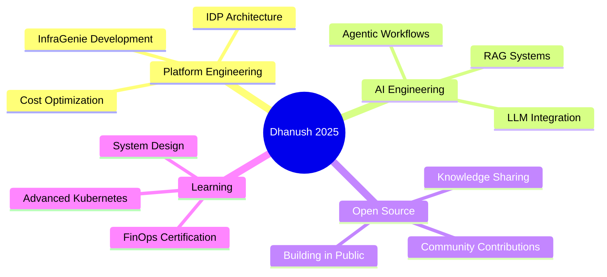

<div align="center">

#  Hey, I'm Dhanush Ranga Gopisetty

<div align="center">
  
</div>

<br/>

[](https://dhanushranga1.dev)
[](https://www.linkedin.com/in/dhanush-ranga-gopisetty-0a910b123/)
[](mailto:dhanushrangag@gmail.com)
[](https://github.com/dhanushranga1)


</div>

<br/>

<div align="center">
  
</div>

<br/>

## Who Am I?

```typescript
const dhanush = {
    location: "🇮🇳 India",
    role: ["Tech Enthusiast", "Aspiring Software Engineer"]
    current_focus: ["Agentic AI Workflows", "Platform Engineering", "FinOps"]

    def philosophy(self):
        # "I believe the best systems are the ones you don't have to babysit."
        # If I have to do a task twice, I automate it. 
        # If it's complex, I simplify it.
        return "Work hard to be lazy."
    
    currently_working_on: {
        project: "InfraGenie",
        description: "An autonomous AI agent that architects cloud infrastructure",
        impact: "Reducing infrastructure provisioning time from days to minutes "
    },
    
    fun_fact: "I automate repetitive tasks even before they become repetitive "
};
```

<br/>

<div align="center">

## **ONGOING PROJECT**


### **[InfraGenie](https://github.com/dhanushranga1/InfraGenie)** — *The Autonomous DevOps Architect*

</div>

<table align="center">
<tr>
<td width="33%" align="center">
  <br/>
  <b>Intelligent Core</b><br/>
  <sub>LangGraph-powered agentic workflow that thinks like a senior DevOps engineer</sub>
</td>
<td width="33%" align="center">
  <br/>
  <b>Complete Toolkit</b><br/>
  <sub>Validated Terraform + Hardened Ansible + Infracost estimates in one package</sub>
</td>
<td width="34%" align="center">
  <br/>
  <b>Cost Assassin</b><br/>
  <sub>Auto-detects and eliminates zombie resources, slashing cloud waste</sub>
</td>
</tr>
</table>

<div align="center">
  
**Impact:** Reducing infrastructure provisioning from **days → minutes** | Cutting cloud costs by **40%+**

</div>

<br/>

<div align="center">

## **SHOWCASE**


</div>

<details open>
<summary><b>TicketPilot</b> — AI-Powered Customer Support Platform</summary>
<br/>

**The Challenge:** Build a context-aware support system that understands customer history and provides intelligent responses.

**The Solution:**
- Implemented **RAG architecture** with FAISS for semantic search across 10K+ support tickets
- Designed **Row-Level Security** in PostgreSQL for bulletproof multi-tenant isolation
- Achieved **<500ms response time** for contextual answers
- Reduced support ticket resolution time by **60%**

**Tech DNA:** `Next.js` `Supabase` `FAISS` `LangChain` `PostgreSQL` `Vercel`

[](https://github.com/dhanushranga1/TicketPilot)

</details>

<details open>
<summary><b>CineReads</b> — Scalable Microservices Recommendation Engine</summary>
<br/>

**The Challenge:** Build a movie recommendation platform that scales to handle 300+ concurrent users without breaking a sweat.

**The Solution:**
- Architected **microservices on Kubernetes** with auto-scaling HPA policies
- Automated infrastructure provisioning with **Terraform**, cutting deployment time by **85%**
- Implemented **FinOps best practices**, reducing AWS costs by **46%**
- Handled **5K+ requests/min** with 99.9% uptime

**Tech DNA:** `Kubernetes` `AWS EKS` `Terraform` `Docker` `Go` `Redis` `MongoDB`

[](https://github.com/dhanushranga1/CineReads)

</details>

<details open>
<summary><b>ScrubPy</b> — Intelligent Data Cleaning Library</summary>
<br/>

**The Challenge:** Create a Python library that automates tedious data cleaning workflows.

**The Solution:**
- Integrated **Mistral LLM** for intelligent data enrichment and anomaly detection
- Built privacy-preserving PII detection and masking
- Published to **PyPI** with comprehensive documentation
- **30+ downloads** in first month, growing community adoption

**Tech DNA:** `Python` `Pandas` `Mistral AI` `NumPy` `PyPI`

[](https://pypi.org/project/scrubpy/)

</details>

<details open>
<summary><b>Keyshade</b> — Open Source Contributions</summary>
<br/>

**The Mission:** Enhance security and stability of an open-source secrets management platform.

**The Impact:**
- Implemented **API rate limiting** to prevent abuse and DDoS attacks
- Improved system reliability and response consistency
- Collaborated with maintainers on security best practices

**Tech DNA:** `Go` `Security` `Open Source` `API Design`

[](https://github.com/keyshade-xyz/keyshade/pull/793)

</details>

<br/>

<div align="center">

## **TECH STACK**


</div>

<table align="center">
<tr>
<td align="center" width="25%">

<br/>AWS
</td>
<td align="center" width="25%">

<br/>Kubernetes
</td>
<td align="center" width="25%">

<br/>Docker
</td>
<td align="center" width="25%">

<br/>Python
</td>
</tr>
<tr>
<td align="center" width="25%">

<br/>React
</td>
<td align="center" width="25%">

<br/>GitHub
</td>
<td align="center" width="25%">

<br/>REST API
</td>
<td align="center" width="25%">

<br/>GraphQL
</td>
</tr>
</table>

<br/>

<div align="center">

### 🛠️ Full Arsenal


</div>

<br/>

<div align="center">

## **GITHUB ANALYTICS**


</div>

<div align="center">
  
  
</div>

<div align="center">
  
  
</div>

<br/>

<div align="center">


## 🎯 **CURRENT MISSION**

</div>



<br/>

<div align="center">

## **LET'S BUILD TOGETHER**


I'm always excited to collaborate on projects involving:

**Platform Engineering** • **AI-Powered DevOps** • **Cloud Architecture** • **Open Source**

</div>

<div align="center">

[](https://www.linkedin.com/in/dhanush-ranga-gopisetty-0a910b123/)
[](https://dhanushranga1.dev)
[](mailto:dhanushrangag@gmail.com)

</div>

<br/>

<div align="center">

---


---

### 💡 *"The best way to predict the future is to automate it."*

<sub>Made by Dhanush | Last Updated: 2025</sub>


</div>
