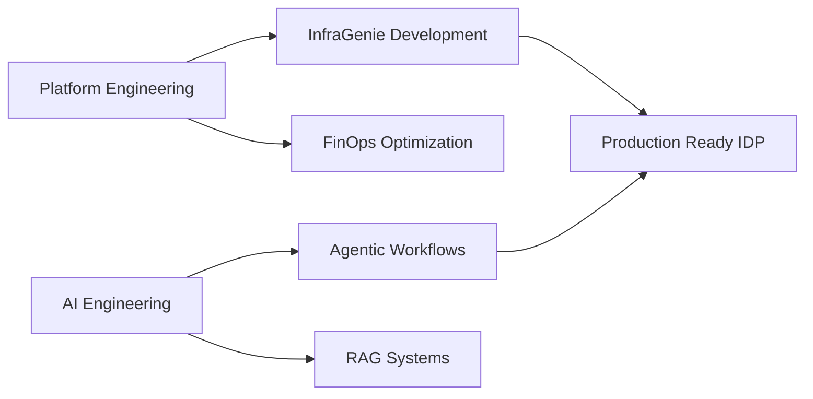

<div align="center">
  
  # 👋 Dhanush Ranga Gopisetty
  
  ### DevOps Architect & AI Engineer
  
  **Building the bridge between Generative AI and Production Infrastructure.**
  
  [](https://dhanushranga1.dev)
  [](https://www.linkedin.com/in/dhanush-ranga-gopisetty-0a910b123/)
  [](mailto:dhanushrangag@gmail.com)
  
  
  
</div>

<br/>

## 💭 Philosophy

```python
class Dhanush(Builder):
    def __init__(self):
        self.drive = "Curiosity"
        self.mission = "Automating the complex"
        self.stack = ["Cloud Native Systems", "Agentic AI", "Platform Engineering"]
        self.location = "🇮🇳 India"
    
    def philosophy(self):
        """
        I don't just write code; I architect systems.
        My goal is to ship tools that solve real engineering friction.
        """
        return "Ship small. Iterate fast. Automate everything."
    
    def currently_learning(self):
        return ["LangGraph Workflows", "Platform Engineering", "FinOps"]
```

<br/>

## 🚀 Currently Building

<div align="center">
  
### [InfraGenie](https://github.com/dhanushranga1/InfraGenie)
**The Autonomous DevOps Architect**

</div>

> An **AI-powered Internal Developer Platform (IDP)** that functions as an autonomous agent to bridge the gap between AI and Platform Engineering.

<table>
<tr>
<td width="33%" align="center"><b>🧠 The Core</b><br/>Agentic workflow built with <b>LangGraph</b> that architects, validates, and secures cloud infrastructure</td>
<td width="33%" align="center"><b>📦 The Output</b><br/>Self-contained "Deployment Kit" with validated <b>Terraform</b>, hardened <b>Ansible</b> playbooks, and <b>Infracost</b> estimates</td>
<td width="34%" align="center"><b>💰 The "Wow"</b><br/>Automatically injects "Cost Assassin" scripts to identify and kill zombie resources</td>
</tr>
</table>

<br/>

## 🏗️ Featured Engineering

<table>
<thead>
<tr>
<th width="20%">Project</th>
<th width="50%">Engineering Challenge & Solution</th>
<th width="30%">Tech Stack</th>
</tr>
</thead>
<tbody>
<tr>
<td><b><a href="https://github.com/dhanushranga1/TicketPilot">🎫 TicketPilot</a></b></td>
<td><b>Context-Aware Support:</b> Engineered a RAG-based support assistant using <b>FAISS</b> for semantic retrieval. Implemented <b>Row Level Security (RLS)</b> in PostgreSQL for strict multi-tenant data isolation.</td>
<td><code>Next.js</code> <code>Supabase</code> <code>FAISS</code> <code>LangChain</code></td>
</tr>
<tr>
<td><b><a href="https://github.com/dhanushranga1/CineReads">🎬 CineReads</a></b></td>
<td><b>Scalable Microservices:</b> Developed a recommendation platform handling 300+ concurrent users. Automating provisioning with <b>Terraform</b> reduced infrastructure costs by <b>46%</b>.</td>
<td><code>Kubernetes</code> <code>AWS</code> <code>Terraform</code> <code>Docker</code></td>
</tr>
<tr>
<td><b><a href="https://pypi.org/project/scrubpy/">🧹 ScrubPy</a></b></td>
<td><b>Data Automation:</b> Created a Python library to automate data cleaning workflows. Integrated <b>Mistral LLM</b> for privacy-preserving data enrichment. <b>30+ downloads</b> in the first month.</td>
<td><code>Python</code> <code>Pandas</code> <code>Mistral LLM</code> <code>PyPI</code></td>
</tr>
<tr>
<td><b><a href="https://github.com/keyshade-xyz/keyshade">🔐 Keyshade</a></b></td>
<td><b>Open Source Security:</b> Contributed API rate limiting to enhance system stability and prevent abuse (<a href="https://github.com/keyshade-xyz/keyshade/pull/793">PR #793</a>).</td>
<td><code>Open Source</code> <code>Go</code> <code>Security</code></td>
</tr>
</tbody>
</table>

<br/>

## ⚡ Technical Arsenal

<div align="center">

### 🏗️ Cloud & Infrastructure


### 🤖 AI & Machine Learning


### 💻 Backend & Databases


### 🎨 Frontend & Tools


</div>

<br/>

## 📊 GitHub Analytics

<div align="center">
  
  
</div>

<div align="center">
  
</div>

<br/>

## 🎯 Current Focus



<br/>

## 📫 Let's Connect

<div align="center">

I'm always interested in collaborating on **Platform Engineering**, **AI-powered DevOps tools**, and **Open Source projects**.

Feel free to reach out if you want to:
- 🤝 Collaborate on innovative projects
- 💡 Discuss AI, DevOps, or Cloud Architecture
- 🌟 Contribute to open source together

[](https://www.linkedin.com/in/dhanush-ranga-gopisetty-0a910b123/)

</div>

<br/>

<div align="center">
  
  **"The best way to predict the future is to build it."**
  
  ⭐ From [dhanushranga1](https://github.com/dhanushranga1)
  
</div>
